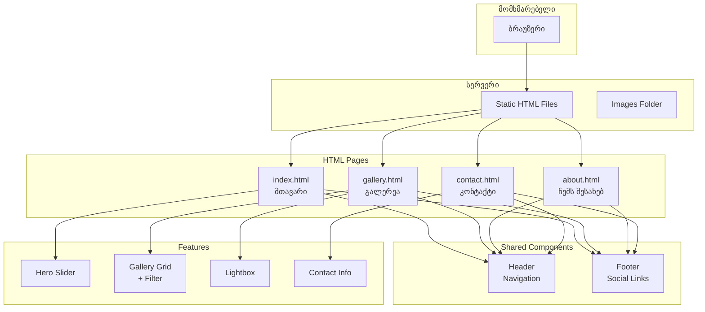
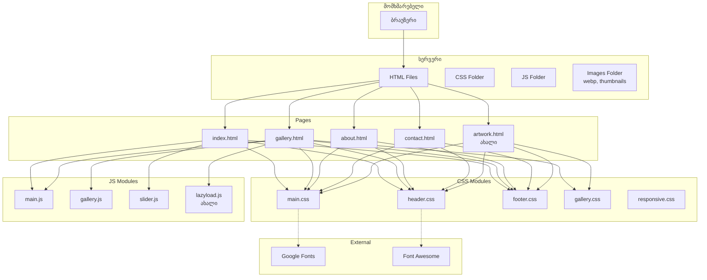
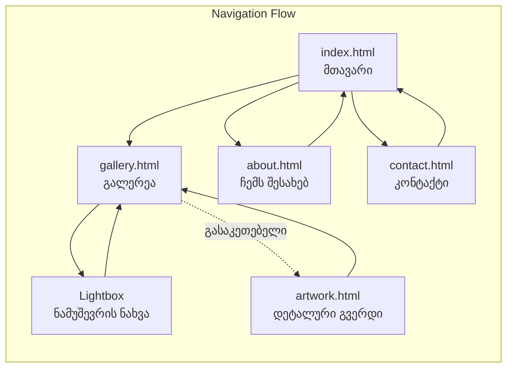
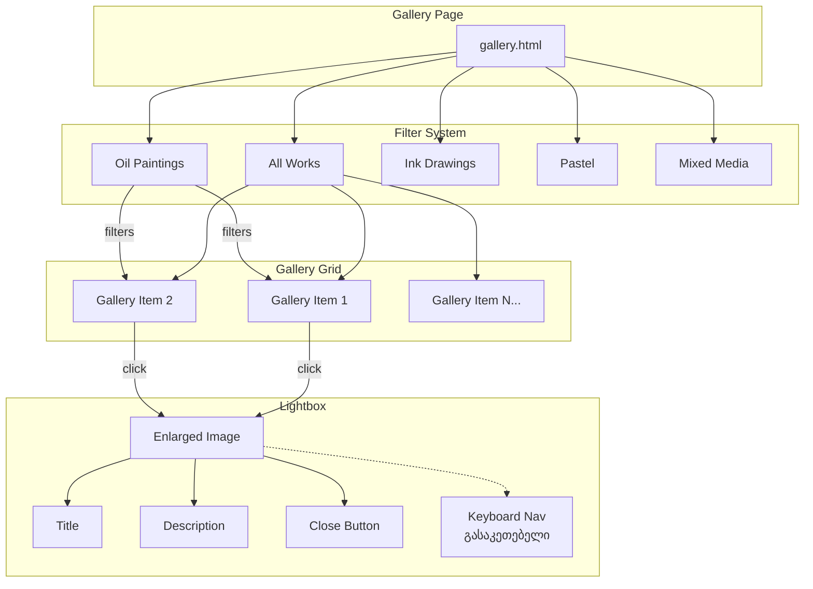
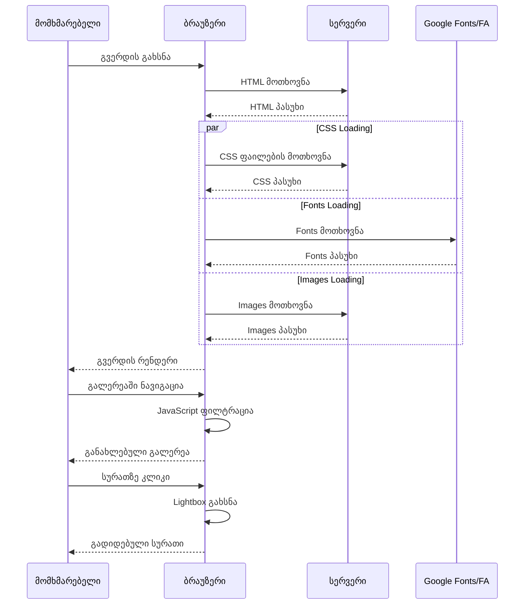

# საიტის არქიტექტურის დიაგრამა

## მიმდინარე სტრუქტურა

```mermaid
graph TD
    subgraph "მომხმარებელი"
        A[ბრაუზერი]
    end

    subgraph "სერვერი"
        B[Static HTML Files]
        C[Images Folder]
    end

    subgraph "HTML Pages"
        E[index.html<br/>მთავარი]
        F[gallery.html<br/>გალერეა]
        G[about.html<br/>ჩემს შესახებ]
        H[contact.html<br/>კონტაქტი]
    end

    subgraph "Shared Components"
        J[Header<br/>Navigation]
        K[Footer<br/>Social Links]
    end

    subgraph "Features"
        L[Hero Slider]
        M[Gallery Grid<br/>+ Filter]
        N[Lightbox]
        O[Contact Info]
    end

    A --> B
    B --> E
    B --> F
    B --> G
    B --> H
    
    E --> J
    E --> L
    E --> K
    
    F --> J
    F --> M
    F --> N
    F --> K
    
    G --> J
    G --> K
    
    H --> J
    H --> O
    H --> K
```

## რეკომენდებული ახალი სტრუქტურა

```mermaid
graph TD
    subgraph "მომხმარებელი"
        A[ბრაუზერი]
    end

    subgraph "სერვერი"
        B[HTML Files]
        C[CSS Folder]
        D[JS Folder]
        E[Images Folder<br/>webp, thumbnails]
    end

    subgraph "Pages"
        F[index.html]
        G[gallery.html]
        H[about.html]
        I[contact.html]
        J[artwork.html<br/>ახალი]
    end

    subgraph "CSS Modules"
        K[main.css]
        L[header.css]
        M[footer.css]
        N[gallery.css]
        O[responsive.css]
    end

    subgraph "JS Modules"
        P[main.js]
        Q[gallery.js]
        R[slider.js]
        S[lazyload.js<br/>ახალი]
    end

    subgraph "External"
        T[Google Fonts]
        U[Font Awesome]
    end

    A --> B
    B --> F
    B --> G
    B --> H
    B --> I
    B --> J
    
    F --> K
    F --> L
    F --> M
    F --> P
    F --> R
    
    G --> K
    G --> L
    G --> M
    G --> N
    G --> P
    G --> Q
    G --> S
    
    H --> K
    H --> L
    H --> M
    
    I --> K
    I --> L
    I --> M
    
    J --> K
    J --> L
    J --> M
    J --> N
    
    K -.-> T
    L -.-> U
```

## გვერდების ნავიგაცია

```mermaid
flowchart LR
    subgraph "Navigation Flow"
        A[index.html<br/>მთავარი] --> B[gallery.html<br/>გალერეა]
        A --> C[about.html<br/>ჩემს შესახებ]
        A --> D[contact.html<br/>კონტაქტი]
        
        B --> E[Lightbox<br/>ნამუშევრის ნახვა]
        B -.->|გასაკეთებელი| F[artwork.html<br/>დეტალური გვერდი]
        
        E --> B
        F --> B
        
        C --> A
        D --> A
    end
```

## გალერეის კომპონენტის სტრუქტურა

```mermaid
graph TD
    subgraph "Gallery Page"
        A[gallery.html]
    end

    subgraph "Filter System"
        B[All Works]
        C[Oil Paintings]
        D[Ink Drawings]
        E[Pastel]
        F[Mixed Media]
    end

    subgraph "Gallery Grid"
        G[Gallery Item 1]
        H[Gallery Item 2]
        I[Gallery Item N...]
    end

    subgraph "Lightbox"
        J[Enlarged Image]
        K[Title]
        L[Description]
        M[Close Button]
        N[Keyboard Nav<br/>გასაკეთებელი]
    end

    A --> B
    A --> C
    A --> D
    A --> E
    A --> F
    
    B --> G
    B --> H
    B --> I
    
    C -->|filters| G
    C -->|filters| H
    
    G -->|click| J
    H -->|click| J
    
    J --> K
    J --> L
    J --> M
    J -.-> N
```

## მონაცემთა ნაკადი

```mermaid
sequenceDiagram
    participant User as მომხმარებელი
    participant Browser as ბრაუზერი
    participant Server as სერვერი
    participant CDN as Google Fonts/FA

    User->>Browser: გვერდის გახსნა
    Browser->>Server: HTML მოთხოვნა
    Server-->>Browser: HTML პასუხი
    
    par CSS Loading
        Browser->>Server: CSS ფაილების მოთხოვნა
        Server-->>Browser: CSS პასუხი
    and Fonts Loading
        Browser->>CDN: Fonts მოთხოვნა
        CDN-->>Browser: Fonts პასუხი
    and Images Loading
        Browser->>Server: Images მოთხოვნა
        Server-->>Browser: Images პასუხი
    end
    
    Browser-->>User: გვერდის რენდერი
    
    User->>Browser: გალერეაში ნავიგაცია
    Browser->>Browser: JavaScript ფილტრაცია
    Browser-->>User: განახლებული გალერეა
    
    User->>Browser: სურათზე კლიკი
    Browser->>Browser: Lightbox გახსნა
    Browser-->>User: გადიდებული სურათი
```
